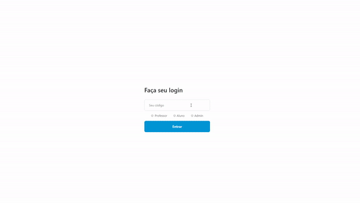

# t1-projarq
Trabalho 1 de PROJARQ - Sistema para Hackathon

# Instruções para uso
 - Ter o Node e npm / yarn instalados
 - Clonar o projeto
 - Executar o comando <b>npm / yarn install</b> nos diretórios <b>client</b> e <b>server</b>
 - No diretório <b>server</b>, executar o comando <b>npm run dev</b> e no diretório <b>client</b>, execute <b>npm start</b>.

# Documentação de arquitetura

Você pode acessar a documentação da arquitetura clicando <a href="https://docs.google.com/document/d/1zkZ9Yngo9jsB6WNxhXb-PocwqzaPT3OhPzi8VOKA1e4/edit?usp=sharing">aqui</a> ou acessando a pasta <b>docs</b> neste repositório.
